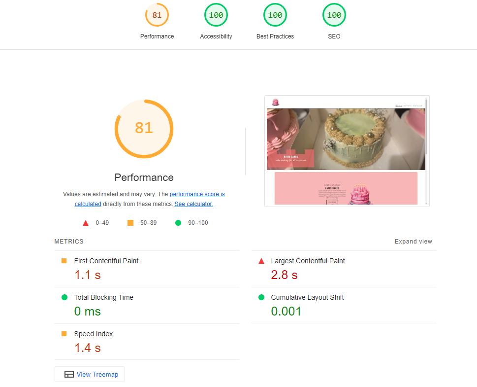

# Kates Cakes
## Kate's Cakes Project Outline

### Project Description:
Kate's Cakes is an online platform designed for a small business specializing in custom-made cakes and cupcakes. Customers can order cakes tailored to their preferences for any occasion, such as birthdays, graduations, and anniversaries. The website will feature a clear step-by-step ordering process, a gallery showcasing previously made cakes, and forms for placing orders and contacting the business.

### Project Goals:
The primary goal of Kate's Cakes is to streamline the ordering process for custom cakes and cupcakes, making it simple and efficient for customers to request personalized baked goods for their special events. By showcasing a gallery of past creations, the website aims to inspire potential customers and demonstrate the quality and creativity of the offerings.

### Target Audience:
The website is intended for individuals and families planning celebrations who seek unique, custom-made cakes and cupcakes. This includes people organizing birthdays, graduations, anniversaries, and other special occasions who desire a personalized touch for their desserts.

Kate's Cakes will be useful for its target audience by providing:
- A user-friendly ordering system that guides customers through the process of customizing their cakes and cupcakes.
- A gallery page that displays previous creations, offering inspiration and showcasing the business's capabilities.
- An ordering form and a contact form, making it easy for customers to place orders and get in touch with the business for any inquiries or special requests.

By meeting these needs, Kate's Cakes aims to enhance the customer experience, ensuring that each celebration is made sweeter and more memorable with personalized baked goods.

## Features
### Navigation Bar
- **Description:** 
  Featured on all pages, the fully responsive navigation bar includes links to the Home page, Gallery, and Order Form page, along with the Logo for easy identification.
- **Value:** 
  This section allows users to easily navigate the website from any device, ensuring a seamless and user-friendly experience.
### Hero Section
- **Description:** 
  The landing page features a hero section with a high-quality photograph of a custom made cake by kate to give users an imediate introductory perspective of the quality of the cakes on offer  and an overlay text that introduces Kate's Cakes as a business . The overlay is in the shape of a cake itself made by the clippy pathmaker.
- **Value:** 
  This section grabs the user's attention immediately, providing a visual representation of the business's offerings and setting the tone for the site's content.

### Call to Action Section
- **Description:** 
  This section prominently displays the website logo and includes a direct link to the order form on the Contact page. it gets users who are already familiar with the brand stright into the ordering process calling them to action.
- **Value:** 
  It encourages users to take immediate action by making it easy to find and access the order form, streamlining the process of placing an order.

### Reasons Section
- **Description:** 
The reasons section features a branded image with a clip path and lists compelling reasons for customers to choose Kate's Cakes.
- **Value:** 
This section builds trust and persuades potential customers by highlighting the benefits and unique selling points of ordering from Kate's Cakes.

### Order Process Section
- **Description:** 
  This section provides a detailed, step-by-step explanation of the ordering process using <ul> tags, accompanied by a background image and responsive design elements.
- **Value:** 
  It ensures that customers understand how to place an order, making the process transparent and straightforward across all screen sizes.

### Gallery Page
- **Description:** 
The gallery page showcases images of previous cake designs, allowing users to browse through various custom creations. the images are layed out in a grid format of three columns that deacreases as the screen size fro device used gets smaller. The background image is a zoomed in version of the hero image and I used figma to achieve this zoom and added  a layer blur on a container in css to prevent it looking pixalated. 
- **Value:** 
This section inspires potential customers by displaying the range and quality of Kate's Cakes, helping them visualize their own custom orders.

### Contact Form Page
- **Description:** 
This page includes a comprehensive purpose built form to suits the unique ordering process for kates cakes and treats. It has options for delivery or pickup,selecting occasion theme or event type, specifying quantity, type of cake, type of treat, date input for the order and an option to make additional notes to the order to make the custom cakes or treats even more special. 

I opted to used javascript to also toggle to display of the address text area field feature on the form. The display can be toggled on and off using a the radio button features for delivery or pick up and I didnt want users wasting time putting in the address if they are going to pick up the order themselves.  

The date feature on the form allows users to choose a date that the order will be made for but also only allows them to order two days in advance. This is a very specific feature to the needs of the business for kates cakes as the treats should be made fresh for a specific date for the occasion, but also the order should be recieved with advanced notice to prepare them. The solution I found to this particular problem was using JavaScript to validate a minimum allowable date in an input field of type "date".
-**Value:** 
It simplifies the ordering process by providing all necessary options and ensuring users can accurately schedule their orders, enhancing the overall user experience.

### Features Left to Implement

- Another feature idea I would do If I were to progress the website would be to make an "add to order toggle button" which once selected the user could add to the current order a different selection of treats and cakes on the same order.

## Testing 

<ul>
<li>I tested that this page works in different browsers chrome, Firefox, safari
<li>I confirm that the navigation, hero, call-to-action, reasons, order process, gallery and contact texts are all readable and easy to understand. 
<li>I have tested and confirm the form works:requires entries in the critical fields, will only accept and email in the email field and the submit button works.
</ul>

### Bugs

#### Solved bugs
The stretched and zoomed image for the background in the gallery and contact pages appeared pixalated. but I liked the images and didn't feel the need to change them so I came up with a nice solution to add a container with a layer blur effect so the image does not appear pixalated but adds the desired effect of focusing the attention to the content on the page which is the gallery and the form on each respective page. 

### Validator Testing

- **HTML**
  - No errors were returned when passing through the official [W3C validator](https://validator.w3.org/nu/?doc=https%3A%2F%2Fdannyobrien761.github.io%2FKates-cakes%2F)
- **CSS**
  - No errors were found when passing through the official [(Jigsaw) validator](http://jigsaw.w3.org/css-validator/validator?lang=en&profile=css3svg&uri=https%3A%2F%2Fdannyobrien761.github.io%2FKates-cakes%2F&usermedium=all&vextwarning=&warning=1)

- **Accessibility**
  - I confirm that with a accessibility score of a 100 in the lighthouse dev tools that the colors and fonts choosen are easy to read and accessible.

## Deployment

This section should describe the process you went through to deploy the project to a hosting platform (e.g. GitHub) 

- The site was deployed to GitHub pages. The steps to deploy are as follows: 
  - in my GitHub repository,  I navigated to the Settings tab 
  - From the source section drop-down menu, I selected the Master Branch
  - Once the master branch has been selected, the page automatically refreshed with a detailed ribbon display to indicate the successful deployment. 

The live link can be found here - https://dannyobrien761.github.io/Kates-cakes/

## Credits 
### Content 
The the code to make the nav bar, footer, reasons and order process section was inspired by and taken from the  CI [Love running project](https://github.com/Code-Institute-Solutions/love-running-v3). Although I have made additions and changes to the code.

the HTML code to structure the gallery was taken from the "love running project". And the CSS to style it completely differently was written myself.

the outlining structure to make the form in html and css for the contact page and form element was taken from  "love running project" link above. I ma 

- To make the clip paths for the hero and reasons images I used [clippy pathmaker](https://bennettfeely.com/clippy/) 
- The icons in the footer were taken from [Font Awesome](https://fontawesome.com/)

- the Javascript on the contact page for the form section for making the address field toggle its display property in css when the delivery radio button was clicked was generated by [chatGPT](https://chatgpt.com/) [link to chat](https://chatgpt.com/share/c82e6611-fd6a-471e-b010-8819107a52fa)

the javascript for  calculating a date that is 2 days ahead of the current date and sets this calculated date as the minimum allowable date in an input field of type date i got by following a [stack overflow thread](https://stackoverflow.com/questions/9989382/how-can-i-add-1-day-to-current-date)

### Media

- The photos used in the hero, reasons, and allery sections were taken by my sister kate of her own cake and treat making and edited by myselfusing photoshop to blur or remove backgrounds and resize or crop images.

- the logo on the call-to action section was created by using the adobe creative cloud suite, adobe Firefly created the image using generative AI I added the test on the adobe express logo making app and then removed the background using adobe photoshop.

- The images used for the background of the order process section and the background of the contact page were taken from unsplash

- for the contact page i used the image by [Jason Briscoe unsplash](https://unsplash.com/photos/white-over-the-range-oven-GliaHAJ3_5A) Published on May 3, 2019
FUJIFILM, X-T2
Free to use under the Unsplash License

- for the order process section on home page I used the image by[Andy Chilton unsplash](https://unsplash.com/photos/flat-lay-photography-of-mug-on-brown-wooden-chopping-board-0JFveX0c778)
Published on January 8, 2016
NIKON CORPORATION, NIKON D3
Free to use under the Unsplash License

